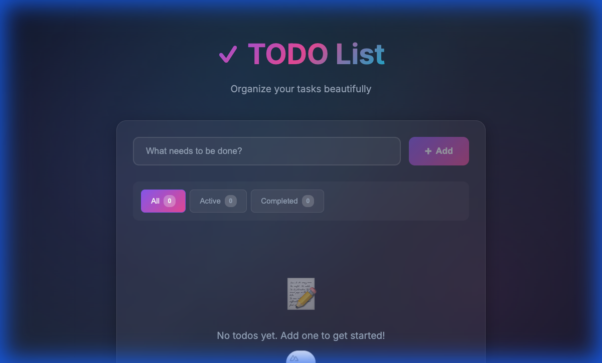
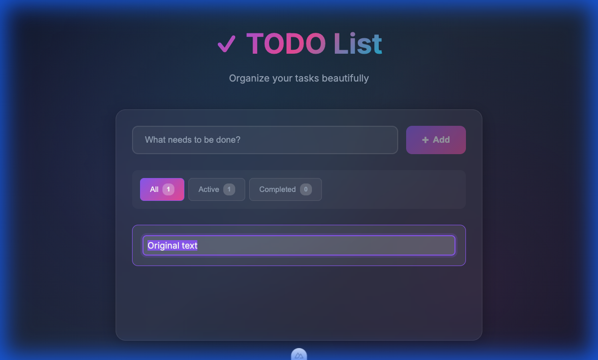
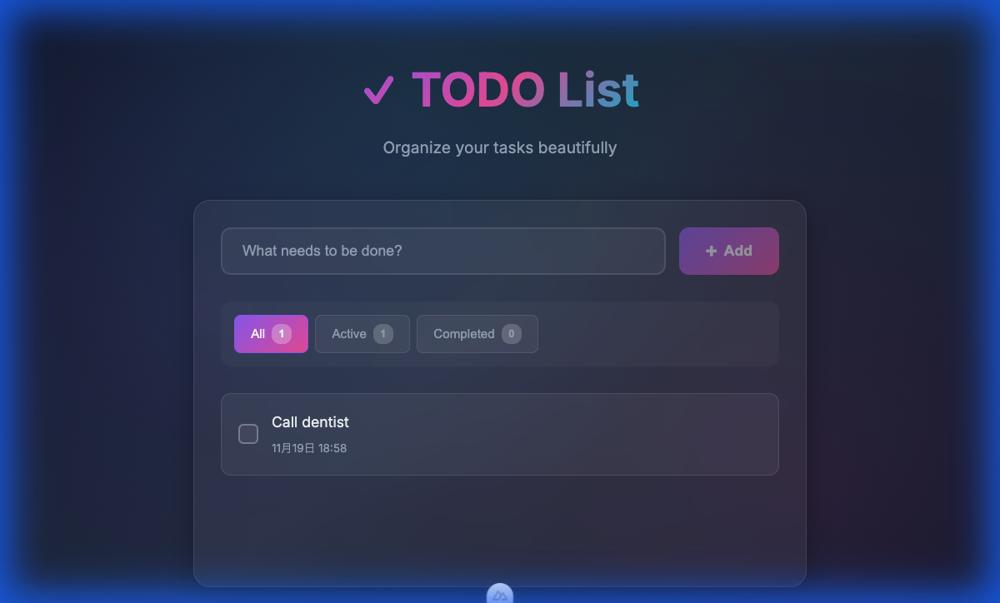
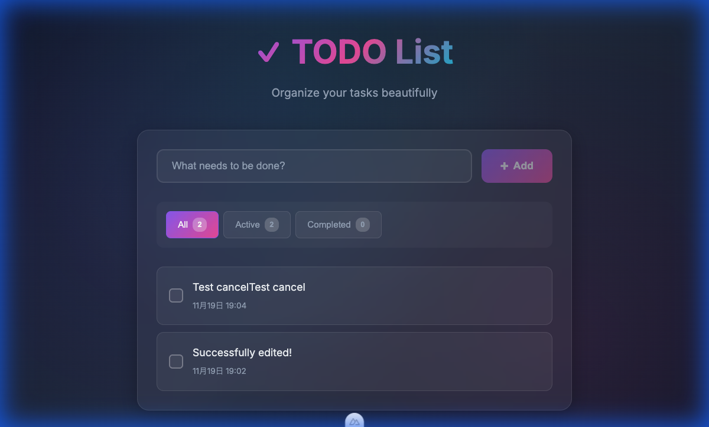

# ToDo List Application

A beautiful and fully functional ToDo List application built with **Nuxt 4**, **Vue 3**, and modern CSS design principles.



## ✨ Features

### Core Functionality

- ✅ **Add Todos** - Create new tasks via input field
- ✅ **Toggle Completion** - Mark tasks as complete/incomplete with checkbox
- ✅ **Edit Todos** - Double-click to edit existing tasks
  - Save with Enter or blur
  - Cancel with Escape
  - Cannot edit completed todos
- ✅ **Filter Todos** - View All, Active, or Completed tasks
- ✅ **Delete Todos** - Remove individual tasks
- ✅ **Clear Completed** - Bulk remove all completed tasks
- ✅ **Persistent Storage** - Todos automatically saved to localStorage

### Design & UI

- 🎨 **Dark theme** with gradient background
- 🔮 **Glassmorphism** card design with backdrop blur
- 🌈 **Vibrant color palette** (Purple, Pink, Cyan gradients)
- ✨ **Smooth animations** for all interactions
- 📱 **Responsive layout** that works on mobile and desktop
- ☑️ **Custom checkboxes** with gradient styling
- 🎯 **Hover effects** and micro-interactions
- 🔤 **Google Fonts** (Inter) for professional typography

## 🚀 Getting Started

### Prerequisites

- Node.js (v18 or higher)
- npm or yarn

### Installation

```bash
# Install dependencies
npm install

# Start development server
npm run dev
```

The application will be available at `http://localhost:3000`

### Build for Production

```bash
npm run build
npm run preview
```

## 📁 Project Structure

```
ToDoList/
├── app/
│   ├── app.vue                    # Main application layout
│   ├── assets/
│   │   └── css/
│   │       └── app.css           # Global styles & design system
│   ├── components/
│   │   ├── TodoInput.vue         # Input field for adding todos
│   │   ├── TodoFilters.vue       # Filter buttons & clear completed
│   │   ├── TodoList.vue          # List container with transitions
│   │   └── TodoItem.vue          # Individual todo item
│   └── composables/
│       └── useTodos.ts           # State management & business logic
├── nuxt.config.ts                # Nuxt configuration
└── package.json                  # Dependencies
```

## 🎯 Usage

### Adding Todos

1. Type your task in the input field
2. Press Enter or click the "Add" button
3. Your todo appears at the top of the list

### Editing Todos

1. Double-click on any active todo text
2. Edit the text in the input field
3. Press Enter to save or Escape to cancel



### Managing Todos

- **Complete/Uncomplete**: Click the checkbox next to any todo
- **Delete**: Hover over a todo and click the × button
- **Filter**: Use the All/Active/Completed buttons to filter your view
- **Clear Completed**: Click "Clear Completed" to remove all finished tasks



## 🛠️ Technical Implementation

### State Management

The `useTodos` composable provides:
- Reactive state using Vue's `useState`
- Computed filtered lists based on active filter
- LocalStorage persistence
- Type-safe Todo interface

### Component Architecture

**TodoInput.vue**
- Controlled input with v-model
- Enter key and button click support
- Disabled state when input is empty

**TodoFilters.vue**
- Dynamic filter buttons with count badges
- Conditional "Clear Completed" button
- Active state styling

**TodoList.vue**
- TransitionGroup for smooth animations
- Empty state messages based on active filter
- Renders TodoItem components

**TodoItem.vue**
- Custom checkbox with gradient styling
- Formatted date display (Japanese locale)
- Delete button with hover reveal
- Strike-through for completed items
- Edit mode with double-click activation
- Save on Enter/blur, cancel on Escape

### Styling System

**CSS Custom Properties:**
```css
--primary: #8b5cf6    /* Purple */
--secondary: #ec4899  /* Pink */
--accent: #06b6d4     /* Cyan */
--bg-primary: #0f172a /* Dark Blue */
```

**Key Design Patterns:**
- Glassmorphism with `backdrop-filter: blur(10px)`
- Gradient backgrounds using `linear-gradient(135deg, ...)`
- Smooth transitions on all interactive elements
- Responsive typography with media queries

## ✅ Testing

All features have been thoroughly tested:

### Feature Testing
- ✅ Add new todos
- ✅ Toggle completion status
- ✅ Edit existing todos
- ✅ Filter by All/Active/Completed
- ✅ Delete individual todos
- ✅ Clear all completed todos
- ✅ LocalStorage persistence

### Animation Testing
- ✅ List item transitions (enter/leave)
- ✅ Button hover effects
- ✅ Checkbox animations
- ✅ Delete button fade-in on hover
- ✅ Filter button active state transitions

### Edit Feature Testing
- ✅ Double-click activates edit mode
- ✅ Input field appears with current text selected
- ✅ Enter key saves changes
- ✅ Escape key cancels editing and reverts text
- ✅ Blur (clicking outside) saves changes
- ✅ Cannot edit completed todos



## 🎨 Design Philosophy

This application demonstrates best practices in modern web design:

1. **Visual Excellence** - Premium UI that wows users at first glance
2. **Smooth Interactions** - Micro-animations enhance user experience
3. **Responsive Design** - Works beautifully on all screen sizes
4. **Type Safety** - Full TypeScript implementation
5. **Clean Architecture** - Well-organized, maintainable code

## 📝 License

MIT

## 🙏 Acknowledgments

Built with:
- [Nuxt 4](https://nuxt.com/)
- [Vue 3](https://vuejs.org/)
- [Google Fonts - Inter](https://fonts.google.com/specimen/Inter)
